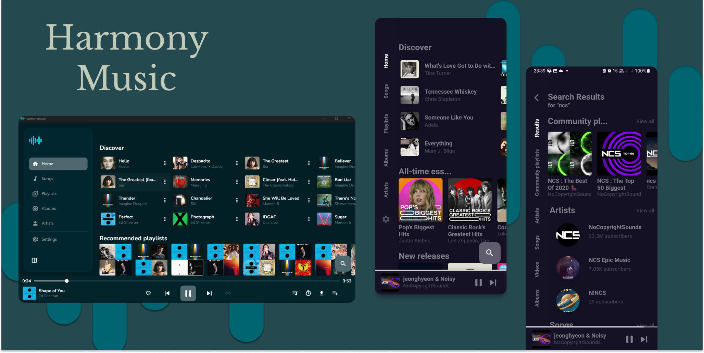
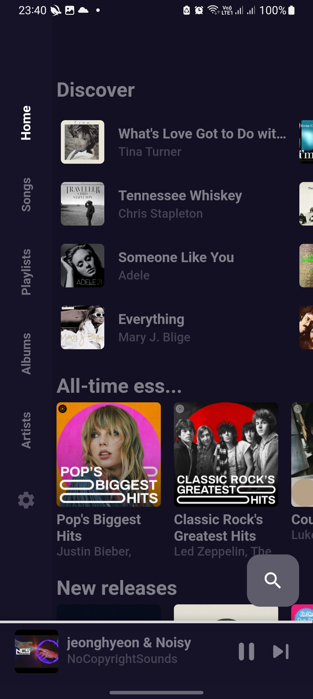
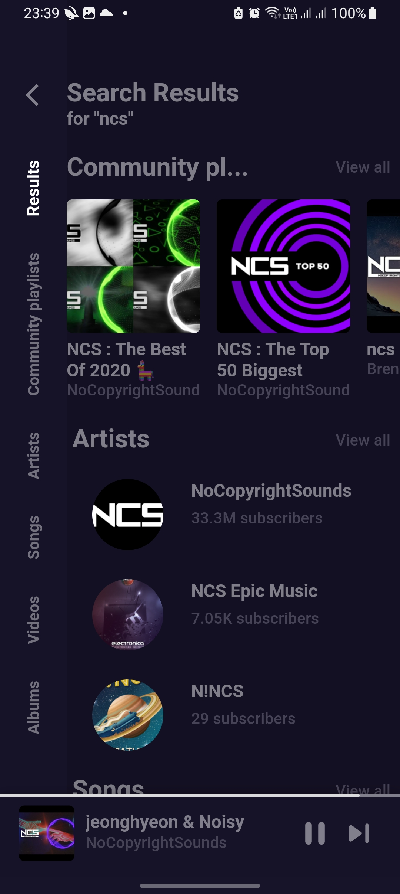

<div align="center">



# Riff Mobile

**YouTube Music, podcasts, audiobooks, and your own servers — on Android.**

No ads. No Google account. No tracking. Personalization stays on your device.

[](https://github.com/Aimdi/Riff-mobile/actions/workflows/build.yml)
[](https://github.com/Aimdi/Riff-mobile/releases/latest)
[](LICENSE)

[Download the latest APK](https://github.com/Aimdi/Riff-mobile/releases/latest)
·
[Desktop Riff](https://github.com/Aimdi/Riff)

</div>

---

Riff Mobile is the Android companion to [Riff](https://github.com/Aimdi/Riff) on Linux: a true-black player with a private on-device discovery engine and a playback stack built to survive YouTube’s constant client changes. It started as a fork of [Harmony Music](https://github.com/anandnet/Harmony-Music) and has grown into a fuller library app — music from YouTube Music, podcasts from the open web, audiobooks from LibriVox and Audiobookshelf, and optional self-hosted music via Subsonic-compatible servers.

<p align="center">
  
  
  
  
</p>

## Highlights

| | |
|---|---|
| **YouTube Music** | Search, home feed, charts, moods, radio, downloads — no login |
| **On-device discovery** | Daily Mixes, Fresh Finds, Release Radar, Rediscover from *your* listens |
| **Podcasts** | Apple directory + any RSS feed, folders, inbox/queue, transcripts |
| **Audiobooks** | LibriVox discover, Audiobookshelf library, catalog browsing |
| **Cloud songs** | Navidrome / OpenSubsonic / Ampache and friends (Subsonic API) |
| **Plugins** | Torrents Digger, SoulSync, Seeker — enable what you need |
| **Privacy** | No ads, no analytics, no Google account — by design |

---

## Music

- Search songs, albums, artists, and playlists on YouTube Music
- Home feed with charts, moods, and recommendations
- **Local discovery engine** — a private taste model on your phone builds Daily Mixes, Fresh Finds, Release Radar, and Rediscover. No YouTube login; nothing leaves the device. Sections appear after a handful of listens (Settings → Riff → Discovery)
- Radio / autoplay when the queue ends
- Full queue control — play next, enqueue, reorder, shuffle, repeat
- Favorites, history, and local playlists
- Offline downloads (cached songs play from disk)
- Piped playlist sync (optional)
- Import songs, playlists, albums, and artists via share from YouTube / YouTube Music
- **“Never Play This”** — ban a track from the song menu; it stays out of radio and suggestions
- Optional [ListenBrainz](https://listenbrainz.org) scrobbling

## Library & cloud

Library tabs cover **Songs**, **Playlists**, **Albums**, and **Artists**.

**Cloud** connects to a Subsonic-compatible server — Navidrome, OpenSubsonic, Airsonic-Advanced, Gonic, Ampache, and similar — so your self-hosted library sits beside YouTube Music. Credentials stay on the device.

## Podcasts

AntennaPod-style podcasts without giving up the rest of Riff:

- Search Apple’s public podcast directory or subscribe to any RSS URL
- Subscriptions, progress, and folders stay on your device
- Spotify-style **folders** for organizing shows
- Inbox / queue workflow for catching up
- **Episode transcripts** when the feed provides them
- Configure defaults under Settings → Riff → Podcasts

## Audiobooks

- **Discover** — free LibriVox titles you can play in-app
- **Library** — connect an [Audiobookshelf](https://www.audiobookshelf.org/) server (same idea as Lissen): stream, resume, upload
- **Catalog** — browse popular titles (preview / listen on Audible where playback isn’t available in-app)
- Bookmark books to a **Saved** shelf

## Plugins

Optional features ship with the app and can be enabled from **Settings → Riff → Plugins**:

| Plugin | What it does |
|---|---|
| **[Torrents Digger](https://gitlab.com/ForTheCommunity/torrentsdigger)** | Search public torrent indexes; open magnets in your torrent client |
| **[SoulSync](https://github.com/Nezreka/SoulSync)** | Talk to your self-hosted SoulSync server (search + request downloads) |
| **[Seeker](https://github.com/jackBonadies/SeekerAndroid)** | Jump to the Seeker companion app for Soulseek |

Only enable plugins you intend to use, and only download content you have the right to use.

## Player & look

- Synced lyrics ([LRCLIB](https://lrclib.net), KuGou fallback) with live highlighting
- Audio effects — bass boost, volume boost, reverb presets, stereo width, speed & pitch
- Equalizer, sleep timer, skip silence, streaming quality
- Pitch Black OLED theme with Riff’s green accent, plus Blue / Violet / Crimson / Amber
- Side nav or bottom nav
- Android Auto
- Many languages
- On-device **Stats** — plays, hours, daily activity, top songs/artists (Settings → Riff)

---

## Why playback keeps working

Most YouTube Music clients break when YouTube rotates player clients or cipher schemes (that’s what ended upstream Harmony Music v1.12.2). Riff layers the approaches used by resilient open-source players:

1. **[NewPipeExtractor](https://github.com/TeamNewPipe/NewPipeExtractor)** resolves streams first — it tracks YouTube’s JS player, signature deciphering, throttling, and SABR enforcement
2. If that fails, a **fallback chain of current, PO-token-free player clients** takes over — `ANDROID_VR` and `VISIONOS` payloads from [Metrolist](https://github.com/mostafaalagamy/Metrolist), then sdk-less Android and iOS via [youtube_explode_dart](https://github.com/Hexer10/youtube_explode_dart) 3.x
3. Every resolved URL is **validated before it reaches the player**, so a dead link falls through instead of failing silently
4. Browse/search requests send a **consent cookie (`SOCS`) and a current browser fingerprint**, so the app works on networks where YouTube enforces consent walls (e.g. the EU)

The YouTube-facing stack is exercised on CI against the live YouTube Music API (home, charts, search, radio, stream resolution) via the *YT API diagnostics* workflow.

---

## Install

Grab an APK from the [releases page](https://github.com/Aimdi/Riff-mobile/releases/latest):

| APK | For |
|---|---|
| `app-arm64-v8a-release.apk` | Most phones (2017+) — **use this** |
| `app-armeabi-v7a-release.apk` | Older 32-bit devices |
| `app-release.apk` | Universal (larger) |
| `app-x86_64-release.apk` | Emulators |

Updates install over the existing app (`com.aimdi.riff`). The app checks this repository’s releases and can offer updates from Settings.

> Sideloading: allow installs from your browser/file manager. Riff is not distributed on the Play Store.

## Build from source

Requires [Flutter](https://docs.flutter.dev/get-started/install) **3.24.x**.

```bash
git clone https://github.com/Aimdi/Riff-mobile.git
cd Riff-mobile
flutter pub get
flutter build apk --release
```

APKs land in `build/app/outputs/flutter-apk/`.

Every push builds APKs on CI. Cutting a GitHub Release: run the *Build Android APK* workflow with a `release_tag` input (or push a `v*` tag).

### Useful targets

```bash
flutter build apk --release --split-per-abi   # arm64 / armeabi-v7a / x86_64
flutter test
```

---

## Related projects

| Project | Role |
|---|---|
| [Riff](https://github.com/Aimdi/Riff) | Native Linux desktop player — design & feature blueprint |
| [Harmony Music](https://github.com/anandnet/Harmony-Music) | Upstream Flutter app this project was forked from |
| [NewPipeExtractor](https://github.com/TeamNewPipe/NewPipeExtractor) | Stream resolution |
| [RiPlay](https://github.com/fast4x/RiPlay) / [Metrolist](https://github.com/mostafaalagamy/Metrolist) | Playback-resilience approaches |
| [SoulSync](https://github.com/Nezreka/SoulSync) / [Seeker](https://github.com/jackBonadies/SeekerAndroid) | Optional plugin backends |

Also used: [youtube_explode_dart](https://github.com/Hexer10/youtube_explode_dart), [LRCLIB](https://lrclib.net), [ListenBrainz](https://listenbrainz.org), Apple’s public podcast directory, LibriVox, Audiobookshelf, Subsonic-compatible servers.

---

## Contributing

Issues and PRs are welcome. For playback breakage after a YouTube change, include device, Android version, app version, and whether Home / Search / stream play fail. CI’s YT API diagnostics job is a good first check.

## License

**GPL-3.0** — see [LICENSE](LICENSE). Required by the Harmony Music base.

Riff Mobile talks to YouTube Music’s public endpoints and is **not affiliated with or endorsed by YouTube, Google, Apple, Audible, or any catalog provider**. Use at your own discretion and respect applicable terms and copyright.
